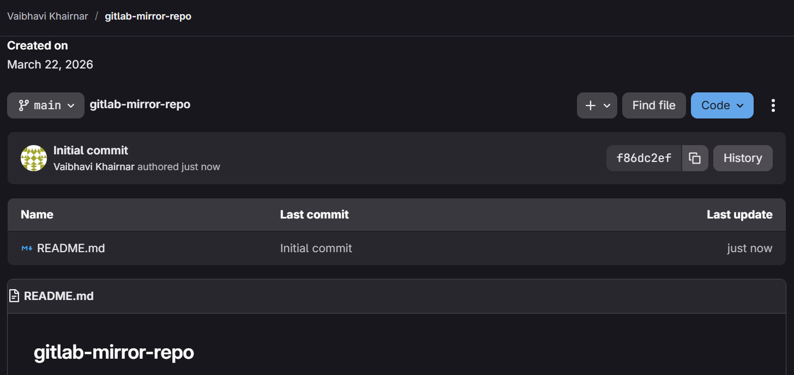
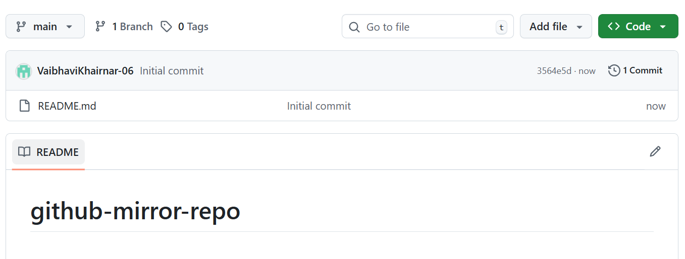
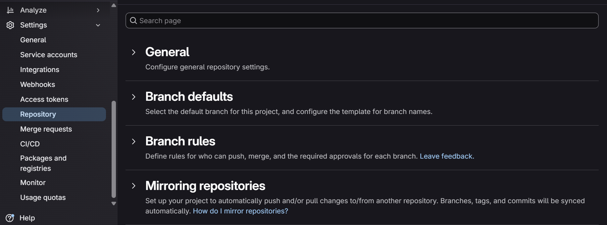
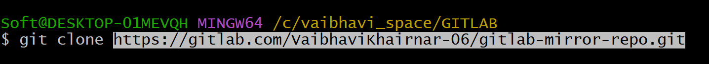
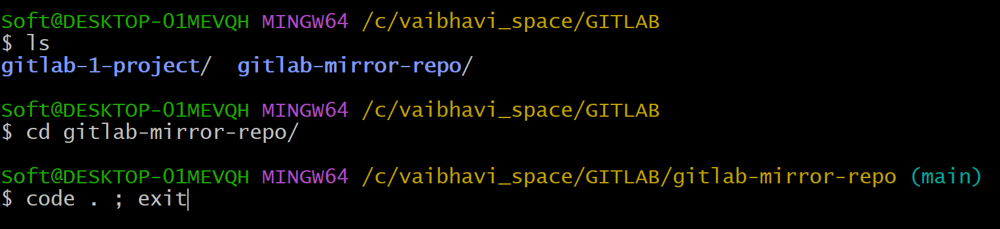
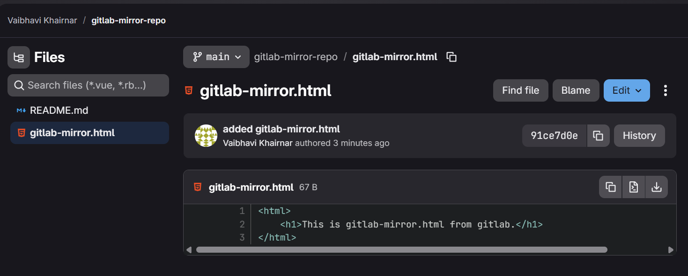
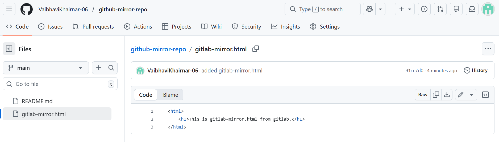

# Gitlab to Github Mirroring.
In this project i will demonstrate steps to set up mirroring between Gitlab and Github.

Mirroring a repository ensures that commits, branches, and tags are automatically synchronized between GitLab and GitHub. This can be configured as Push mirroring (GitLab to GitHub) or Pull mirroring (GitHub to GitLab). Here i'll configure Push Mirroring (GitLab to GitHub).
***
## Prerequisites
Before starting, ensure you have:
* Authentication: You need to create a GitHub Personal Access Token(PAT) from github with `repo`,`public_repo` scope.
***
## Setting up PUSH Mirroring.

## Step 1: Generate a token.
1. In Github, go to **Settings > Developer Settings > Personal Access Tokens.**
2. Generate a new classic token with `repo` and `public_repo` scope.(You can add as many scope you need).
3. **Copy the token immediately**, it is one time token you won't see it again.

## Step 2: Create repositories.
Inorder to mirror a repository you need to create one.(You can use existing github repo too).

My gitlab repository:

My github repository:

## Step 3: Congifure Gitlab.
1. Navigate to your project in GitLab.
2. Go to Settings > Repository.
3. Click on Mirroring repositories section.

4. Fill the following:
* Git repository URL: `https://github.com/VaibhaviKhairnar-06/github-mirror-repo.git`
* Mirror direction: Select **Push**.
* Authentication method: Select **Username and Password**.
* Add your github username.
* Password: Paste your Github **Personal Access Token**.
5. Click **Mirror Repository**.
***
## Step 4: Clone with HTTPs.
1. Copy the gitlab HTTPs URL.
2. Open gitbash inside your workspace and `git clone`.
3. Here's mine
 

4. Create a file on VS code and add content.
5. To push the file on gitlab 
`git add .` > `git commit -m "added file"` > `git push -u origin main`.
6. Come to gitlab and refresh it.
You'll see your file and same file on github as well.
***

This is Gitlab.

This is github with same file.
